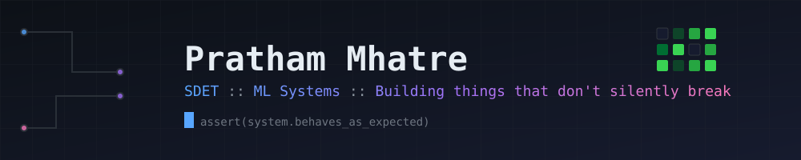

 

---

### 💫 About Me

I'm Pratham — currently working the QA/SDET side professionally while completing an MSc in Machine Learning on the side, and the gap between those two worlds is basically my whole personality at this point.

- 🔭 **Right now:** building an LLM eval harness that catches silent failures — confident fabrication, non-determinism, the stuff that passes every test and is still wrong
- 🧠 **MSc focus:** agent-based simulation grounded in real demographic data
- 🧪 **The QA lens on ML:** most people test models like they test features. I test them like they test *systems that lie convincingly*
- 🛠️ **Design philosophy:** the LLM is the interface, not the intelligence — the real logic lives in the deterministic components it calls
- 📍 Based in Thane, Maharashtra — open to SDET / AI-ML-adjacent roles across Navi Mumbai

 

### 🧩 Currently building

**[LLM Eval Harness](https://github.com/blizwing/eval-harness)**
Detecting silent failure modes in production LLM systems — confident fabrication on ungrounded fields, non-determinism at temperature=0, the failures that pass every check and are still wrong.
`Python` `DeepSeek API` `Eval Design`

**[Job Applier](https://jobsapp.blueflameapps.com)**
End-to-end job application automation — Chrome extension (MV3) with semantic field-detection, FastAPI backend, Gmail OAuth, multi-provider AI routing. Live UAT deployment.
`Python` `FastAPI` `Chrome Extension` `PostgreSQL` `AWS Lightsail` `Docker`

More projects (including Chronicle AI) → [**PROJECTS.md**](./PROJECTS.md)

 

### 🛠️ Tech Stack

**Core**

    

**QA / Automation**

   

**Backend / Web**

   

**ML / Data**

         

**Infra / Tools**

            

 

### 📊 GitHub Stats

  

 

### 🎭 Off the clock

Test cases and model evals during the day, a decent amount of reading and games the rest of the time.

 

